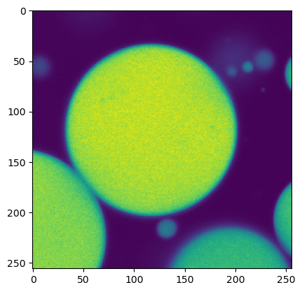
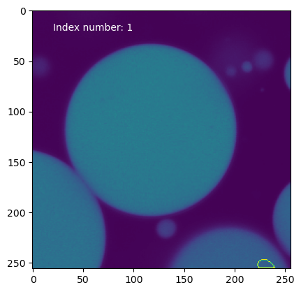
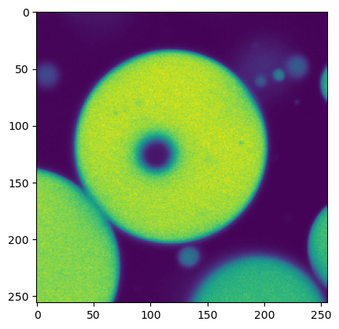
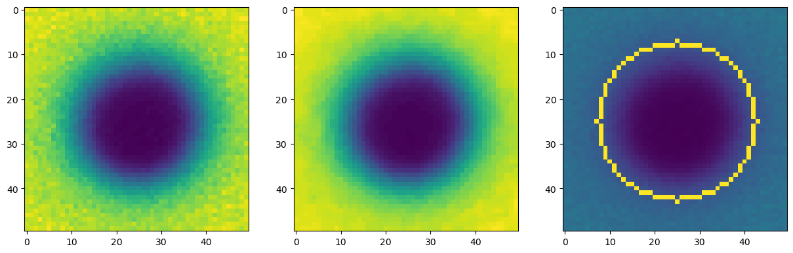
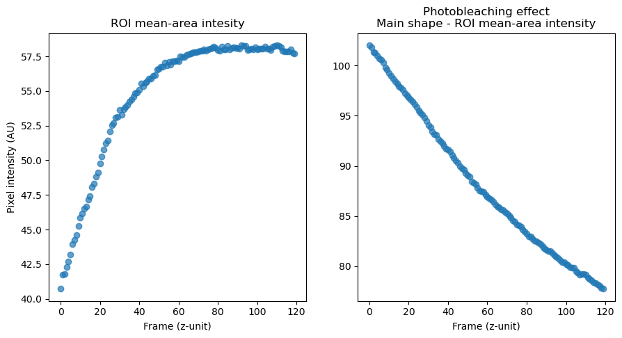
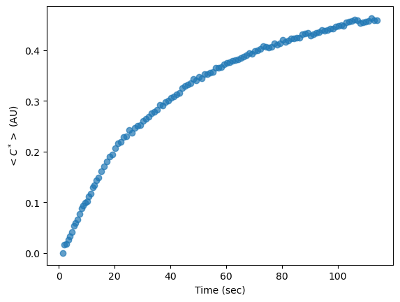

# FRAPAnalyzer
A script for analyzing LIF Files of FRAP experiment with moving target. The code is meh but it works!

The main equations for the fitting of the intensity profile and the intenisty normalization approach is taken from the work of Taylor et al. [1]

[1] Taylor, N.O., Wei, M-T, Stone, H.A and Brangwynne C.P., Quantifying Dynamics in Phase-Separated Condensates Using Fluorescence Recovery after Photobleaching, *Biophys. J.* **117**, (2019), 1285-1300.

# Functions

Currently .py files except main.py containt all of the functions and actions, and are not really usable outside of my env. This will be fixed once the project is more defined.  

# Example notebook

```python
import shapeanalysis as shpa
import numpy as np
import matplotlib.pyplot as plt
import cv2 as cv
import pims

from readlif.reader import LifFile, LifImage
from utility import dataLoader
from scipy.optimize import curve_fit
from scipy.interpolate import UnivariateSpline
from sklearn.metrics import r2_score


from sklearn.mixture import GaussianMixture
from scipy.ndimage import median_filter
from scipy.spatial import distance
from skimage.exposure import rescale_intensity, equalize_adapthist

import operator

def make_list(file_name):
    lif_file_name = f'/data_in/{file_name}'
    lif_files = LifFile(f'./{lif_file_name}')
    return [i for i in lif_files.get_iter_image()]

def _get_timelime_run(runs_dict, name, bleach_frames):


    time_scale_data = []

    for run in runs_dict[name]:
        if isinstance(run.scale_n[4], float):
            time_scale_data.append((1/run.scale_n[4], run.dims_n[4]))
    
    init_construct = np.arange(0, bleach_frames, 1)*time_scale_data[0][0]
    #print(init_construct)

    def append_to_timeline(range, scale):
        timetime_to_append = np.arange(1, range+1, 1)*scale
        adder_array = init_construct[-1]
        new_construct = np.append(init_construct, timetime_to_append+adder_array)
        
        return new_construct

    for parameters in time_scale_data:

        init_construct = append_to_timeline(parameters[1], parameters[0])

    return init_construct

def _get_runs_dicts(lif_files_list):

    frap_experiment_dict = {}

    def append_to_dict(file, name):
        if name in frap_experiment_dict:
            list_addition = frap_experiment_dict[f'{name}']
            list_addition.append(file)
            frap_experiment_dict[f'{name}'] = list_addition
        else:
            frap_experiment_dict[f'{name}'] = [file]
            
            
    name_check = lif_files_list[0].name.split('/')[0]

    for file in lif_files_list:
        current_file_name = file.name.split('/')[0]
        if current_file_name == name_check:
            append_to_dict(file, name_check)
        else:
            append_to_dict(file, current_file_name)
            name_check = current_file_name
    
    return frap_experiment_dict 
```

Implementation in this notebook is not the most clearest, if at all.<br>
Later this function will be added to the utility.py and should be loaded from there. There are plans to add some increased compatibilty with different formats.<br>
As for now its strictly .lif data formats that are available. Planning to add ability to add TIF files + deferntiale bitween 8- and 16-bit grayscale images.<br>


```python
def load(filename):
    run_FAF = make_list(str(filename))
    faf_runloaded = dataLoader(run_FAF)
    name_input = input('Enter the name of the frap experiment e.g. "FRAP 001" ')
    faf_frap007 = faf_runloaded.getFrameInRun(str(name_input))  #bubbles 3, 12 
    run_dict = _get_runs_dicts(run_FAF)
    run_names = list(run_dict.keys())
    timeline = _get_timelime_run(run_dict, str(name_input), 2)
    time_scaler = 1/run_FAF[1].scale_n[4]
    position_scaler = 1/run_FAF[1].scale_n[2]
    parameters = {'t_scaler':time_scaler, 'p_scaler':position_scaler}
    return faf_frap007, timeline, parameters
```


```python
data_list, timeline, img_parameters = load('221130i_FAF_1_2.lif')
```

Convert PIL image object into np.array() for easier handling of the data.


```python
frame_arrays = [np.array(i) for i in data_list]
```

Bellow we pring the first image in the expeminet's stack of images.


```python
img1 =  frame_arrays[0] #chaing the index of arrays, we can acess different images in the stack(time stack).
plt.imshow(img1)
plt.show()
```


    

    


In the case where we have mutiple circular shapes in the frame we need to first 1) find the shape inside the first frame (pre-bleach frame - pbF)<br>
that correspnd to the shape of intereset (SOI), meaning a shape where bleaching is taking place.


```python
def define_mainshape(image, index=None):
    if index is None:
        minor_shape_loaded = shpa.MinorShapeAnalysis(image)
        num_contours = len(minor_shape_loaded.contour_on_labeled_image()[0])
        checker = 0
        for i in range(num_contours):
            plt.imshow(minor_shape_loaded.draw_contour_index(i))
            plt.text(20, 20, f'Index number: {i}', c='w')
            plt.show()
            
            checker = input('Press 1 followed by Enter to select the contour, else press 0')
            
            if int(checker) == 1:
                mean_background = minor_shape_loaded.contour_mean_by_index(i)
                print(mean_background)
                return mean_background
            else:
                continue
    else:
        minor_shape_loaded = shpa.MinorShapeAnalysis(image)
        mean_background = minor_shape_loaded.contour_mean_by_index(index)
        return mean_background

```

Here, if index= is not provided then you can peak the main shape to get the mean background intensity of the pre bleached frame from.<br>


```python
mean_bg = define_mainshape(img1)
print(f'<I> for prebleachned infinte phase = {round(mean_bg, 2)} AU')
```


    

    


    

    


    

    


    

    


    

    


    104.38286235186874
    <I> for prebleachned infinte phase = 104.38 AU
    


```python
img2 =  frame_arrays[1] #chaing the index of arrays, we can acess different images in the stack(time stack).
plt.imshow(img2)
plt.show()
```


    

    


Function bellow establishes the radius of the photobleached region.<br>
Beased on the normalized image data the radius is found based on the 0.8 concentration-intensity value.<br>
It basically the same as in Image analysis for FRAP part of work of [N.O. Taylor et al.](https://www.cell.com/biophysj/fulltext/S0006-3495(19)30747-7)<br>
The only sifnificant deviation is the estamation of 0.8 point, in my inplementation it is simple Euclidian distance from the center of the bleached area (in the code, found my minimal mean of the x and y arrays). Will probalby change this to something simillat to the paper, fitting something to the data and fiding x intensity. As this approach is prone to random errors and random high value pixel readings. (Adding filtering to the analyzed image)<br> 


```python
def get_fitRadius(image):
    minor_shape_loaded = shpa.MinorShapeAnalysis(image)
    bg_mean_inf = minor_shape_loaded.main_shape_mean_photobleaching()
    roi_data = minor_shape_loaded.roi_array_w_parameters()
    normLoad = shpa.NormalizedImageAnalysis(roi_data, bg_mean_inf)
    rad08_hw = normLoad.radius_HWL_08()
    min_00_value = normLoad.min_point_fromdata()
    mask = np.zeros_like(roi_data[0])
    cv.circle(mask, (int(mask.shape[1]/2),int(mask.shape[1]/2)), int(rad08_hw), 255, cv.FILLED)
    min_avrg_00_value = np.mean(roi_data[0][np.where(mask==255)])
    return rad08_hw, min_00_value, normLoad, min_avrg_00_value
```


```python
roi_radius_08, min_00_value, loaded_roi, min_avrg_00_value = get_fitRadius(img2)
```

To check the preliminary resutls we can picture the image of a ROI (as defined by the radius of the fitted circle*)<br>


```python
raw_image_roi = loaded_roi.roi_image_array
normalized_image_roi = loaded_roi.imageNormalization()
normalized_image_roi_w_rad = loaded_roi.draw_cricle_set_radius(int(roi_radius_08))
```


```python
fig, ax = plt.subplots(1, 3, figsize=(15, 5))
ax[0].imshow(raw_image_roi)
ax[1].imshow(normalized_image_roi)
ax[2].imshow(normalized_image_roi_w_rad)
plt.show()
```


    

    


Now in order to collect the data on intensity in time me keep the ROI radius the same and try to find the center of the photobleached ROI<br>
We don't need to preform normalization on each frame since we can apply the normalazation transormation on the mean values of intenisty by noting $<C(r,0)>$, recorded in variable **min_00_value**. Then we need to collect average values of $<C(r, t)>$ and $<C_{ref}>$ and this is basically what this script is doing.


```python
roi_mean_data = []
inf_mean_data = []
```


```python
buffer = {'mean_intensity_roi':0, 'mean_intensity_inf':0}

for frame in frame_arrays[1:]: #here we skip the first frame, since algorth doesn't work on the frames without this specific structure of bleached area inside unbleached one
    loaded_frame = shpa.MinorShapeAnalysis(frame)
    #try:
    try:
        roi_image, roi_center = loaded_frame.roi_array_w_parameters()
        mask = np.zeros_like(roi_image)
        center = (int(mask.shape[1]/2),int(mask.shape[0]/2))
        cv.circle(mask, center, int(roi_radius_08), 255, cv.FILLED)
        roi_mean = np.mean(roi_image[np.where(mask==255)])
        buffer['mean_intensity_inf'] = roi_mean
    except:
        roi_mean = buffer['mean_intensity_inf']

    roi_mean_data.append(roi_mean)

    try:
        inf_shape_contour = loaded_frame.containing_contour_biggest_get()
        mask_main = np.zeros_like(frame)
        cv.drawContours(mask_main, [inf_shape_contour], -1, 255, cv.FILLED)
        cv.circle(mask_main, roi_center, int(roi_radius_08), 0, cv.FILLED)
        bg_mean_inf = np.mean(frame[np.where(mask_main==255)])
        buffer['mean_intensity_inf'] = bg_mean_inf
    except:
        bg_mean_inf = buffer['mean_intensity_inf']
    #except:
    #    bg_mean_inf = buffer['mean_intensity_roi']
    inf_mean_data.append(bg_mean_inf)
    
```

Below is the type of data one would get if the script worked as intended and colllected the correct data.<br>
On Figure 1, you can see the mean-area intensity profile of the circle with radium R = **roi_radius_08**


```python
fig, ax = plt.subplots(1,2, figsize=(10.5, 5))
ax[0].scatter(np.arange(0, len(roi_mean_data)), np.array(roi_mean_data),alpha=0.7)
ax[0].set_ylabel('Pixel intensity (AU)')
ax[0].set_xlabel('Frame (z-unit)')
ax[1].scatter(np.arange(0, len(inf_mean_data)), np.array(inf_mean_data),alpha=0.7)
#ax[1].set_ylabel('Pixel intensity (AU)')
ax[1].set_xlabel('Frame (z-unit)')
ax[1].set_title('Photobleaching effect\nMain shape - ROI mean-area intensity')
ax[0].set_title('ROI mean-area intesity')
plt.show()
```


    

    


We can now convert the frame number in seconds, using scaling factors and **_get_timeline** function above. <br>
And truncating the timeline to account for frist and two bleacing frames.


```python
truncated_timeline = timeline[2:]
print(len(truncated_timeline), len(roi_mean_data))
```

    120 120
    

The using the equation bellow we convert the results into "concentration" as per [Taylor et. al](https://www.cell.com/biophysj/fulltext/S0006-3495(19)30747-7)
$$<C^*>(t)=\frac{<C(r,t)>-<C(r,0)>}{<C_{ref}>-<C(r, 0)>} \\$$
This equation takes into account photobleacinh effect, and results in more easilly interpetable data.


```python
normalized_mean_area_intensity = (np.array(roi_mean_data)-min_avrg_00_value)/(np.array(inf_mean_data)-min_avrg_00_value)
```


```python
plt.scatter(truncated_timeline, normalized_mean_area_intensity, alpha=0.7)
plt.ylabel(r'$<C^*>$ (AU)')
plt.xlabel('Time (sec)')
plt.show()
```


    

    


Now we can analyze the recovery curve and fit a model of your linkig.

Bellow is a script to record video with drawn ROI and main shape. Can be use for visual inspection of the data.


```python
size = (frame_arrays[0].shape[1],frame_arrays[0].shape[0])

video_out = cv.VideoWriter('exmaple_video.mp4', 0, 24, size)

buffer = {'roi_center':0, 'main_contour':0}
i=0
for frame in frame_arrays[1:]: #here we skip the first frame, since algorth doesn't work on the frames without this specific structure of bleached area inside unbleached one
    
    loaded_frame = shpa.MinorShapeAnalysis(frame)
    frame_copy = frame.copy()
    #try:
    try:
        roi_image, roi_center = loaded_frame.roi_array_w_parameters()
        #mask = np.zeros_like(roi_image)
        center = (int(mask.shape[1]/2),int(mask.shape[0]/2))
        cv.circle(frame_copy, roi_center, int(roi_radius_08), 255, 1)
        #roi_mean = np.mean(roi_image[np.where(mask==255)])
        buffer['roi_center'] = roi_center
    except:
        cv.circle(frame_copy,  buffer['roi_center'], int(roi_radius_08), 255, 1)

    try:
        inf_shape_contour = loaded_frame.containing_contour_biggest_get()
        #mask_main = np.zeros_like(frame)
        cv.drawContours(frame_copy, [inf_shape_contour], -1, 255, 1)
        buffer['main_contour'] = inf_shape_contour
    except:
        buffered_contour = buffer['main_contour']
        cv.drawContours(frame_copy, [buffered_contour], -1, 255, 1)
    video_out.write(frame_copy)
    print(f'Frame {i} -> Done', end='', flush=True)
    i += 1
video_out.release()
```

    Frame 0 -> DoneFrame 1 -> DoneFrame 2 -> DoneFrame 3 -> DoneFrame 4 -> DoneFrame 5 -> DoneFrame 6 -> DoneFrame 7 -> DoneFrame 8 -> DoneFrame 9 -> DoneFrame 10 -> DoneFrame 11 -> DoneFrame 12 -> DoneFrame 13 -> DoneFrame 14 -> DoneFrame 15 -> DoneFrame 16 -> DoneFrame 17 -> DoneFrame 18 -> DoneFrame 19 -> DoneFrame 20 -> DoneFrame 21 -> DoneFrame 22 -> DoneFrame 23 -> DoneFrame 24 -> DoneFrame 25 -> DoneFrame 26 -> DoneFrame 27 -> DoneFrame 28 -> DoneFrame 29 -> DoneFrame 30 -> DoneFrame 31 -> DoneFrame 32 -> DoneFrame 33 -> DoneFrame 34 -> DoneFrame 35 -> DoneFrame 36 -> DoneFrame 37 -> DoneFrame 38 -> DoneFrame 39 -> DoneFrame 40 -> DoneFrame 41 -> DoneFrame 42 -> DoneFrame 43 -> DoneFrame 44 -> DoneFrame 45 -> DoneFrame 46 -> DoneFrame 47 -> DoneFrame 48 -> DoneFrame 49 -> DoneFrame 50 -> DoneFrame 51 -> DoneFrame 52 -> DoneFrame 53 -> DoneFrame 54 -> DoneFrame 55 -> DoneFrame 56 -> DoneFrame 57 -> DoneFrame 58 -> DoneFrame 59 -> DoneFrame 60 -> DoneFrame 61 -> DoneFrame 62 -> DoneFrame 63 -> DoneFrame 64 -> DoneFrame 65 -> DoneFrame 66 -> DoneFrame 67 -> DoneFrame 68 -> DoneFrame 69 -> DoneFrame 70 -> DoneFrame 71 -> DoneFrame 72 -> DoneFrame 73 -> DoneFrame 74 -> DoneFrame 75 -> DoneFrame 76 -> DoneFrame 77 -> DoneFrame 78 -> DoneFrame 79 -> DoneFrame 80 -> DoneFrame 81 -> DoneFrame 82 -> DoneFrame 83 -> DoneFrame 84 -> DoneFrame 85 -> DoneFrame 86 -> DoneFrame 87 -> DoneFrame 88 -> DoneFrame 89 -> DoneFrame 90 -> DoneFrame 91 -> DoneFrame 92 -> DoneFrame 93 -> DoneFrame 94 -> DoneFrame 95 -> DoneFrame 96 -> DoneFrame 97 -> DoneFrame 98 -> DoneFrame 99 -> DoneFrame 100 -> DoneFrame 101 -> DoneFrame 102 -> DoneFrame 103 -> DoneFrame 104 -> DoneFrame 105 -> DoneFrame 106 -> DoneFrame 107 -> DoneFrame 108 -> DoneFrame 109 -> DoneFrame 110 -> DoneFrame 111 -> DoneFrame 112 -> DoneFrame 113 -> DoneFrame 114 -> DoneFrame 115 -> DoneFrame 116 -> DoneFrame 117 -> DoneFrame 118 -> DoneFrame 119 -> Done


```python

```
